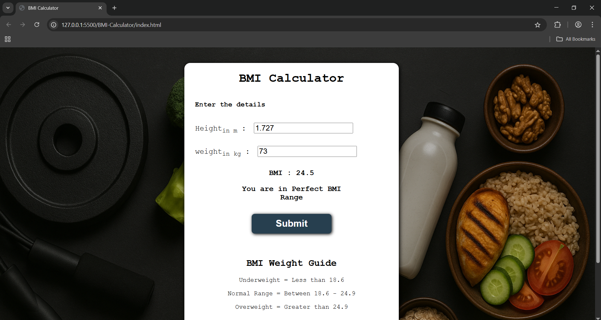

# BMI Calculator

This is a simple and elegant BMI (Body Mass Index) Calculator built using **HTML**, **CSS**, and **JavaScript**. It calculates your BMI based on height and weight and classifies it as Underweight, Normal, or Overweight.

## Preview
 

---

##  Live Demo

- [View live Here]()

---

## Features

- Clean and minimal UI
- Background image for health & fitness feel
- Real-time BMI Calculation
- Displays BMI category (Underweight / Normal / Overweight)
- Fully responsive for different screen sizes

---

## Tech Stack

- HTML
- CSS
- JavaScript

---

## Learnings

- DOM Manipulation using JavaScript
- Basic form input handling
- Dynamic result display
- CSS styling for better layout and user experience

---

## 📄 License

This project is licensed under the [MIT License](LICENSE).  

---

## Author

Made by **Pratham Gambhir**  
🔗 [GitHub](https://github.com/prathamgambhir)  
🔗 [Twitter/X](https://x.com/_PrathamGambhir)
