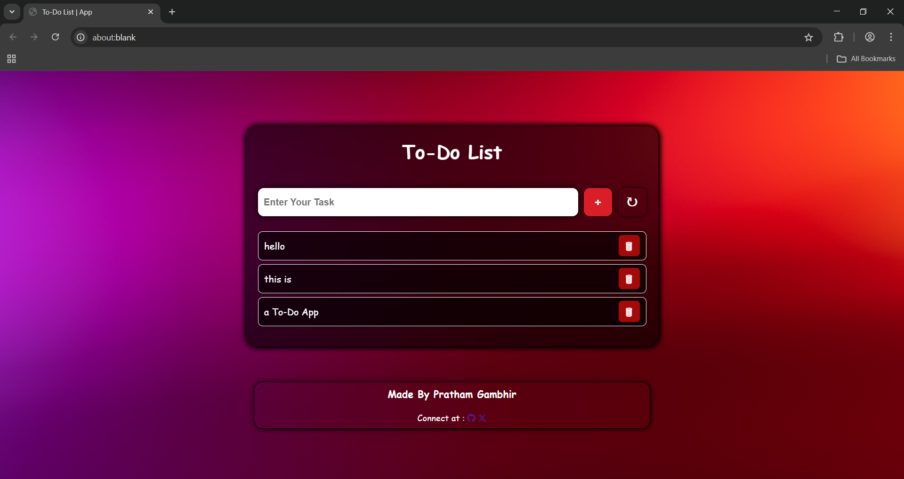

# To-Do List Web App

A beautifully designed and fully responsive To-Do List application built using **HTML**, **CSS**, and **JavaScript**. This app allows users to add, remove, and mark tasks with a sleek interface that adapts to all screen sizes and also the tasks will be saved even after closing the site/screen.

-------------

## Preview

-------------

## Live Demo

[Click here to view live app]()

------------

## Features

- Add tasks with a single click
- Remove tasks with a delete button
- Tasks will be saved even after closing the screen
- Mark tasks as completed (strike-through effect)
- Reload/reset button to clear all tasks
- Mobile responsive design with Flexbox

-------------

## Tech Stack

- HTML
- CSS
- JavaScript

-------------

## What I Learned

- Flexbox layout with wrapping and alignment
- How to use local storage to save data
- How to clear the data from local storage
- DOM manipulation using JavaScript
- Creating mobile-first designs with media queries

------------------

## Author

- [Pratham Gambhir](https://github.com/prathamgambhir)
- Connect at [X (formerly Twitter)](https://x.com/_PrathamGambhir)

